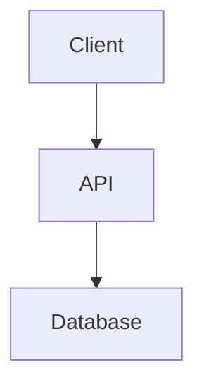

# Fumadocs Conventions

Project-specific conventions for `apps/docs/`. For full Fumadocs documentation, see `llm/context/ts/fumadocs/`.

## Frontmatter

Required on every `.mdx` file:

```yaml
---
title: "Page Title"
description: "Brief summary of what and why (< 160 chars)"
---
```

Optional fields (used for exploration/chat pages):

```yaml
date: "2026-01-19"          # YYYY-MM-DD, for dated content
agent: "claude"             # enum: claude | gemini | gpt | other
tags: ["offline-first"]     # searchable tags
```

## File Naming

- **Doc pages**: `kebab-case.mdx` (e.g., `live-document.mdx`)
- **Exploration chats/reports**: `YYYYMMDD-kebab-case.md` (e.g., `20260119-json-merge-conflicts.md`)
- **Section metadata**: `meta.json` in every directory

## Content Tree

```
content/docs/
├── meta.json                  # Root: ["(dev)", "architecture", "ai"]
├── (dev)/                     # Developer guides (parentheses = URL group, no /dev/ in URL)
├── architecture/              # System design and architecture
│   ├── document-framework/    # Nested subsections supported
│   ├── project-domain/
│   ├── security/
│   └── ...
├── ai/                        # AI/LLM docs
└── exploration/               # Research chats and reports
```

To add a new page: create the `.mdx` file, then update the nearest `meta.json`.

## meta.json Format

```json
{
  "title": "Section Title",
  "description": "What this section covers",
  "icon": "LucideIconName",
  "root": true,
  "pages": [
    "---Separator Label---",
    "page-slug",
    "another-page",
    "...subdirectory"
  ]
}
```

- `pages` array controls sidebar order
- `"---Label---"` creates a visual separator in the sidebar
- `"...dirname"` expands a subdirectory inline
- Filenames in `pages` omit the `.mdx` extension
- Every new file MUST be added to `pages` or it won't appear in navigation

## Heading Hierarchy

- **H1**: auto-generated from frontmatter `title` — NEVER use `#` in content
- **H2** (`##`): top-level sections within the page
- **H3** (`###`): subsections
- **H4** (`####`): rarely needed, avoid deep nesting

## MDX Components

### Callouts

```mdx
<Callout type="info">
  Key takeaway or important note.
</Callout>

<Callout type="warn">
  Gotcha, edge case, or danger.
</Callout>
```

### Tabs (polyglot code)

```mdx
<Tabs items={['Python', 'TypeScript']}>
  <Tab value="Python">
    ```python
    # Python implementation
    ```
  </Tab>
  <Tab value="TypeScript">
    ```typescript
    // TypeScript implementation
    ```
  </Tab>
</Tabs>
```

### Steps (sequential instructions)

```mdx
<Steps>

### Install dependencies

```bash
pnpm install
```

### Configure the client

```typescript
const client = createClient({ ... })
```

</Steps>
```

### Cards (navigation hubs)

```mdx
<Cards>
  <Card title="Getting Started" href="/docs/dev/setup" />
  <Card title="Architecture" href="/docs/architecture" />
</Cards>
```

### Mermaid Diagrams

````mdx

````

Use Mermaid for: system overviews, data flow, state machines, component relationships.
See `llm/context/shared/mermaid/` for syntax reference.

### Accordions (progressive disclosure)

```mdx
<Accordions>
  <Accordion title="Advanced: Custom configuration">
    Detailed content hidden by default.
  </Accordion>
</Accordions>
```

## Code Blocks

- ALWAYS specify language tag: ` ```python `, ` ```typescript `, ` ```bash `
- Use real project patterns, not generic examples
- Comments explain *why*, not *what*
- Code must be complete enough to copy-paste and run
