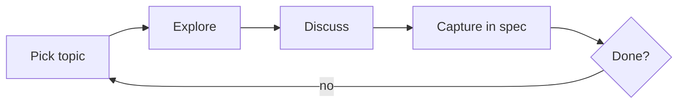

# Writing Specs

Co-author design specs through iterative dialogue. A spec is the bridge between "we discussed this" and "someone can build it."

## What a Spec Is

A **spec** (design doc / technical design document) is **crystallized architectural intent** — a living document through which decisions take shape. It starts rough, sharpens through conversation, and ends as the contract between "what we decided" and "what gets built."

- The contract between intent and implementation
- One spec = one coherent feature or change
- **The iteration medium** — draft the file early, even incomplete, and iterate on it together. The spec is how we convey understanding and course-correct, not just the final deliverable. Always ask the user before updating.
- Settled once finalized — later refinements reference the original and amend specific sections, but the core decisions stand
- Not an RFC (pre-decision), not a plan (execution steps), not docs (explanation for others)

## What Makes a Good Spec

- **Buildable** — an implementer can work from it without re-asking "what did you mean?"
- **Decision-explicit** — states choices made AND alternatives rejected
- **Scoped** — bounded problem, not a kitchen sink
- **Grounded** — references the actual codebase (models, endpoints, components that exist today)
- **Honest about unknowns** — open questions are surfaced, not hidden
- **Visual** — uses compact diagrams (ASCII or Mermaid) to convey architecture and flows; a good diagram replaces paragraphs of prose
- **Well-named** — introduces precise taxonomy: terms are self-explanatory, concise, aligned with existing codebase naming, and consistent across layers (Python <> TypeScript <> DB)
- **Boundary-clear** — defines what each component is AND is not responsible for; states interfaces, ownership boundaries, and layering explicitly

## The Form

**File:** `llm/specs/YYYY-MM-DD-title.md`

A spec has **frontmatter** and **body sections**.

### Frontmatter

Every spec starts with YAML frontmatter — three fields, no more:

```yaml
---
title: Mutation Session Architecture
date: 2026-02-17
description: Event-sourced mutation sessions with offline-first sync and conflict resolution
---
```

All three fields are **mandatory**:

- **title** — human-readable name (no quotes needed in YAML)
- **date** — creation date, YYYY-MM-DD
- **description** — max 2 lines answering "why should I open this file?"

### H1 Title + Date

Right after the frontmatter, the file must have an **H1 heading** matching the YAML title, followed by the date on the next line as an inline code block:

```markdown
# Mutation Session Architecture

`date: 2026-02-17`

## Context
...
```

### Body Sections

The H2 sections are **enforced** — they are the backbone of every spec. Use exactly these headings in this order:

| H2 Section           | Purpose                                                                  | Required?                          |
| -------------------- | ------------------------------------------------------------------------ | ---------------------------------- |
| **Context**          | Why this exists, what problem it solves                                  | Always                             |
| **Requirements**     | What must be true when done — structured with subsections               | Always                             |
| **Design**           | How it works — architecture, data model, flows, API surface, UI behavior | Always                             |
| **Decisions**        | Explicit choices with rationale — "X over Y because Z"                   | When non-obvious choices were made |
| **Open Questions**   | Things still unresolved                                                  | When unknowns remain               |
| **References**       | Related specs, ADRs, external resources                                  | When they exist                    |

#### Requirements subsections

Requirements **must** be organized into these H3 subsections:

- **Goals** — what must be true when done (functional requirements, capabilities)
- **Non-Goals** — what is explicitly out of scope (prevents scope creep, clarifies boundaries)
- **Constraints** — technical or business constraints that bound the solution space

#### Design: Key Concepts (mandatory first subsection)

The **first subsection** of Design must be a **Key Concepts** table that defines the taxonomy — the terms, types, and components the spec introduces or redefines. This table is the shared vocabulary for the rest of the spec.

| Concept | Definition | Responsibility | Notes |
|---------|-----------|----------------|-------|
| `HeadMeta` | Typed extract from `head_revision` | Searchable/displayable fields for listing | Lives in `py/domain`, transposed to `ts/domain` |
| `ProjectMeta` | Lightweight listing model | Project summary without heavy `head_revision` | Replaces `ProjectSummary` |

Columns are flexible — adapt to what matters (e.g., add "Python / TypeScript" columns for cross-stack naming, drop "Notes" if unnecessary). But the table itself is mandatory.

After Key Concepts, Design is **freely organized** in H3/H4 subsections to reflect the specific architecture. Use whatever structure fits: diagrams, tables, code signatures, file-change matrices. Match the level of detail to the scope.

#### Design guidance

**Boundaries.** For each significant component, state explicitly: what it owns, what it delegates, what it does NOT do. Use a responsibility matrix (component x concern) or a boundary diagram. Define the interfaces between components — not just what they are, but what crosses the boundary (data, calls, events). This is what makes a spec implementable without guesswork.

**Contracts.** Include code blocks for key abstractions: types, interfaces, method signatures, schemas. These are the **contracts**, not the implementation — show the shape, not the body. Group related signatures in a single code block to preserve readability (avoid one block per function). A well-chosen code block anchors the spec to real, buildable structures.

**Diagrams are first-class.** Prefer compact ASCII diagrams for layer boundaries, data flows, and responsibility maps. Use Mermaid for sequence diagrams or complex graphs. A well-drawn diagram communicates architecture faster and more precisely than prose — invest time in making them clear and minimal.

#### References format

Use **markdown links** whenever possible for easy navigation:

```markdown
## References

- [Project Ledger Collection spec](2026-03-03-specs-project-ledger-collection.md) — current sync pipeline
- [`py/domain/project/`](../../packages/py/domain/auditoo_domain/project/) — domain models
- [`apps/api/routes/v1/projects/`](../../apps/api/auditoo_api/routes/v1/projects/) — API endpoints
```

Relative paths from the spec file. External URLs are fine too. The goal is one-click navigation for the reviewer.

## Process

Writing a spec is a **conversation, not a pipeline**. Use normal discussion flow — no forms, no structured prompts. Talk naturally, iterate, capture.

### Draft Early

The spec file is the **iteration medium**, not just the final artifact. Draft it early — even with incomplete sections — so both parties can see the emerging shape and course-correct. A rough draft reviewed early is worth more than a polished draft reviewed late.

- Create the file with frontmatter + section skeleton as soon as the topic is clear
- Fill what you know, leave sections sparse or with placeholders
- **Ask the user before updating the file** — "Want me to update the spec with what we just discussed?" or "I'll capture this in the Design section, sound good?"
- Each update to the file is a checkpoint: summarize what changed, suggest what to discuss next

### Setup

1. Understand what we're speccing — ask if unclear
2. Create `llm/specs/YYYY-MM-DD-title.md` with frontmatter + empty section skeleton
3. **Explore the codebase thoroughly** — this step is critical, see below

### Exploration (Continuous)

Exploration runs throughout — not just at setup. Scale depth to change complexity.

**Initial:** Scan key terms across codebase, index prior specs/plans in `llm/`, dispatch subagents for independent exploration threads, map touch points, surface existing conventions.

**Ongoing:** Re-scan codebase with narrower terms as decisions crystallize. **Always consult `llm/context/` package docs before assuming anything about library APIs or patterns** — come back to them as the design evolves, early assumptions may be wrong. Web search only when local docs fall short.

A spec that stops exploring mid-way drifts from reality.

### Iterate

Loop through sections conversationally — the spec file is a **living document**, updated incrementally:



1. **Pick a topic** — user-driven or suggest what's missing
2. **Explore** — re-scan code, check local docs (`llm/context/`), web search as needed
3. **Discuss** — surface trade-offs, challenge assumptions, reference codebase findings. Normal conversation — no forms, no structured prompts.
4. **Capture** — ask the user, then update the spec file. Summarize what changed, suggest next topic.

### Finalize

When the user says it's complete:

1. Review the full spec for consistency and completeness
2. Flag **ADR candidates** — decisions worth extracting as standalone records
3. Suggest running `writing-adrs` to harvest decisions from this spec

## Complementary Skills

| Skill             | Relationship | When to use instead                                                                              |
| ----------------- | ------------ | ------------------------------------------------------------------------------------------------ |
| `brainstorming`   | Upstream     | Still exploring alternatives, not ready to crystallize                                           |
| `doc-coauthoring` | Methodology  | High-stakes spec needing deeper co-authoring — escalate mid-session if spec grows contentious or needs reader testing |
| `writing-adrs`    | Downstream   | Harvest atomic decisions from a finished spec                                                    |
| `/implement`      | Downstream   | Turn a spec into an execution plan                                                               |

## Common Mistakes (Content)

- **Inventing names** — using a term in the spec that doesn't match the codebase, or naming the same concept differently in Python vs TypeScript sections
- **Phantom contracts** — defining types/interfaces without checking what already exists; the spec proposes `InspectionResult` but the codebase already has `DiagnosticResult`
- **Happy-path-only flows** — sequence diagrams that show success but never error, retry, or offline scenarios
- **Boundary hand-waving** — "the API handles validation" without saying what happens when validation fails, who gets the error, in what shape
- **Stale grounding** — referencing a model or endpoint that was renamed or removed since the last time you checked

## Anti-Patterns (Process)

- **Writing the whole spec in one shot** — defeats the purpose. Work section by section.
- **Speccing before deciding** — if still exploring alternatives, use brainstorming first.
- **Kitchen-sink specs** — if it covers multiple unrelated features, split.
- **Speccing trivial changes** — a one-liner fix doesn't need a spec. Use judgment.
- **Skimping on exploration** — a spec written without understanding the current codebase will be wrong. Explore first.
- **Walls of prose** — if you're writing 3+ paragraphs to describe a flow, draw a diagram instead.
- **Vague boundaries** — "X handles Y" without saying what X does NOT handle. If two components could plausibly own the same concern, the spec must resolve it.
- **Late drafting** — waiting until the discussion is "done" to write the spec. Draft early, iterate on the document.
- **Using forms or structured prompts** — this is a conversation. Ask questions naturally, discuss trade-offs in flowing text.
